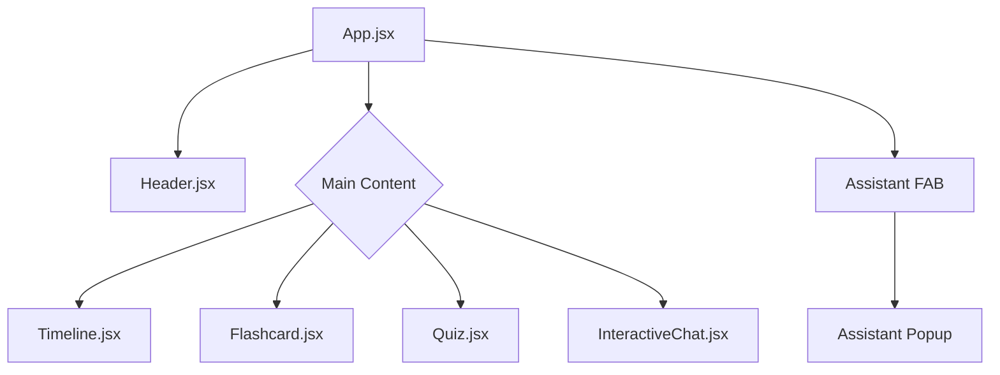
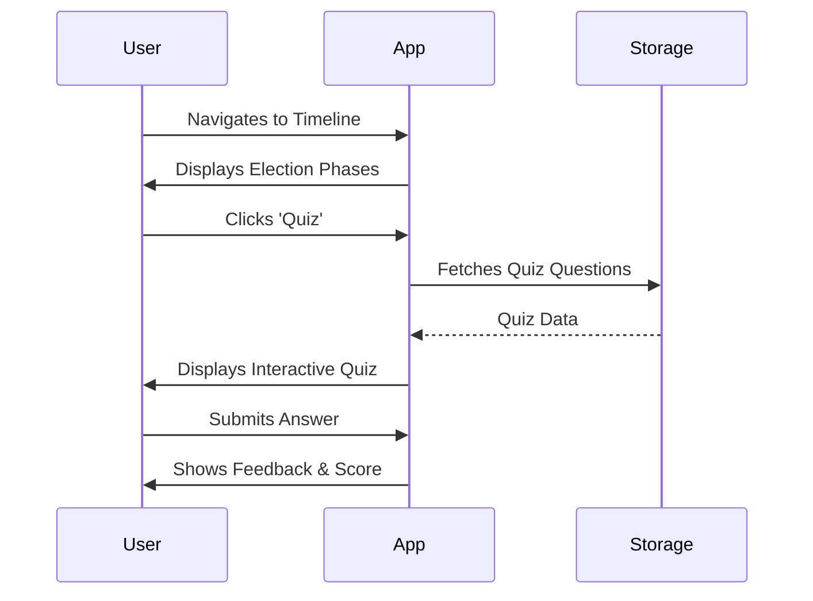

# 🗳️ Indian Election Assistant

**Live Demo: [https://election-assistant-411391941393.us-central1.run.app](https://election-assistant-411391941393.us-central1.run.app)**


An interactive, AI-powered web application designed to educate citizens about the Indian electoral process. From timelines to terminology, the Election Assistant makes democratic procedures accessible and engaging.

## 🌟 Key Features

- **Interactive Timeline**: A visual journey through the phases of an election, from announcement to results.
- **Educational Flashcards**: Learn key electoral terms and concepts through interactive cards.
- **Knowledge Quizzes**: Test your understanding of the democratic process with gamified quizzes.
- **AI-Powered Chat Assistant**: A dedicated assistant to answer contextual questions about elections.
- **Responsive Design**: Premium, mobile-friendly interface built with modern CSS and animations.

## 🏗️ Architecture & Flow

### Component Structure


### User Journey


## 🛠️ Tech Stack

- **Frontend**: [React](https://reactjs.org/) + [Vite](https://vitejs.dev/)
- **Styling**: Vanilla CSS (Modern CSS variables, Flexbox/Grid)
- **Icons**: [Lucide React](https://lucide.dev/)
- **Deployment**: Optimized for Docker and Google Cloud Run

## 🚀 Getting Started

### Prerequisites
- Node.js (v18 or higher)
- npm or yarn

### Installation
1. Clone the repository:
   ```bash
   git clone https://github.com/Praveeng029/Election-Assistant.git
   ```
2. Navigate to the project directory:
   ```bash
   cd Election-Assistant
   ```
3. Install dependencies:
   ```bash
   npm install
   ```
4. Start the development server:
   ```bash
   npm run dev
   ```

## 🐳 Docker Support

To run the application using Docker:
```bash
docker build -t election-assistant .
docker run -p 8080:80 election-assistant
```

---
Built with ❤️ for democratic awareness.
